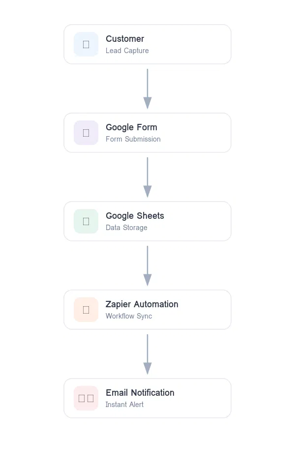
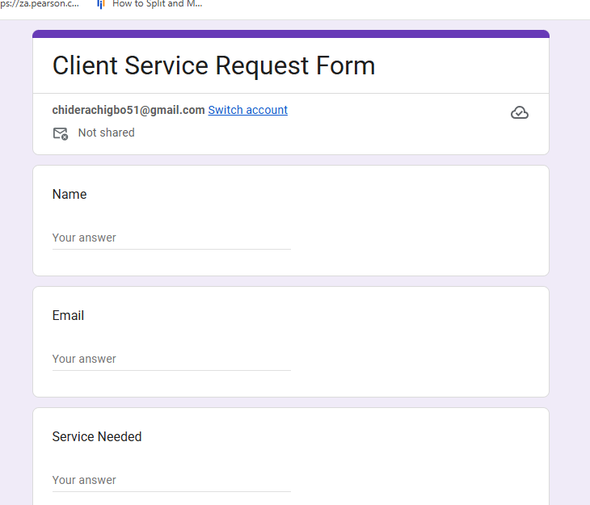
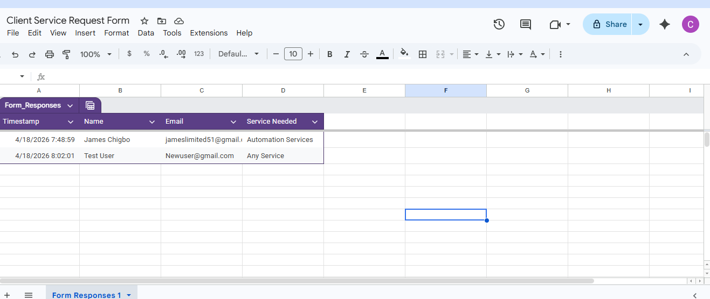
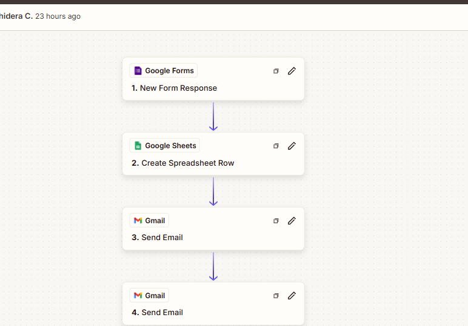

# Lead Capture Automation System

## Project Description

The project shows the capabilities of using an automation system to collect leads for small businesses.

The solution takes the information entered by the client on a form, saves it to a spreadsheet, and sends automatic notifications to the business owner.

---

## Problem

Many small businesses use online forms to receive customer inquiries, yet do not keep track of them.

As a result, potential clients are overlooked and lost.

---

## Solution

Lead management process with the following steps:

• Gathering customer contact information from a form  
• Saving the received data to a spreadsheet  
• Sending automatic notifications to the business owner  
• Sending confirmation emails to the customer  

---

## Workflow Diagram

Client → Google Form → Google Sheets → Zapier → Email Notification

1. The customer fills out the form  
2. The data goes to Google Sheets  
3. Zapier triggers the script  
4. An email notification goes to the business owner  
5. The confirmation email goes to the customer

---

## Used Tools

- Google Forms  
- Google Sheets  
- Zapier  
- Gmail  

---

### Lead Capture Form

### Stored Leads in Spreadsheet

### Zapier Automation Workflow

---

## Conclusion

The automation system allows you to gather leads and send notifications without manual involvement.

It eliminates the risk of losing valuable customers.
